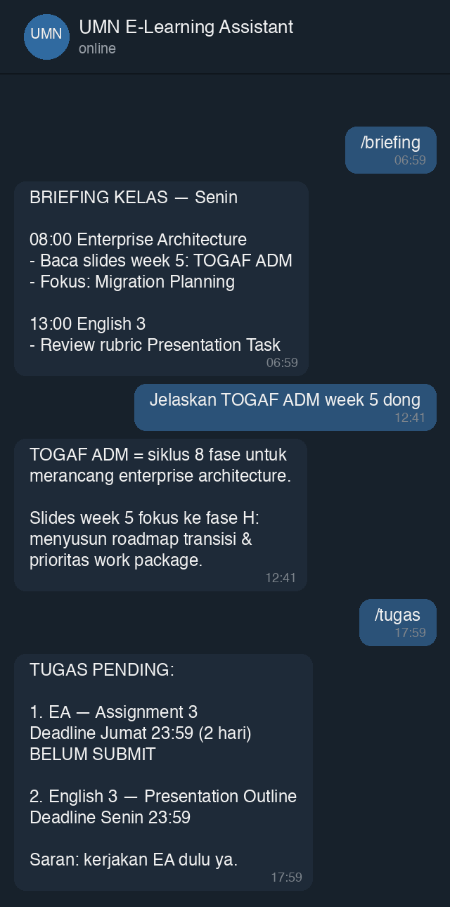

# 🎓 UMN E-Learning Assistant (Telegram Bot + Cron Auto-Sync + AI RAG)



Asisten pintar berbasis AI yang terhubung langsung ke **E-Learning Universitas Multimedia Nusantara (UMN)**, otomatis mengunduh materi kuliah (PDF, PPTX, Word), mengekstrak teks & slide, memantau deadline tugas, serta mengirimkan **Daily Morning Class Prep Briefing** dan **Assignment Reminder** langsung ke Telegram kamu.

---

## ✨ Fitur Utama

1. **Auto-Downloader & Parser (`sync.py`)**:
   - Login otomatis ke E-Learning UMN (`https://elearning.umn.ac.id/`).
   - Mengunduh materi, slide, dan lampiran tugas semester aktif ke `data/materials/`.
   - Mengekstrak teks dari PDF, PPTX, dan DOCX ke `data/extracted_text/`.
2. **Daily Morning Class Prep Briefing (Cron Job - 07:00 WIB)**:
   - Setiap pagi sebelum kelas dimulai, AI merangkum materi apa yang perlu dipersiapkan, slide mana yang harus dibaca, dan apa inti bahasan hari ini berdasarkan jadwal kuliah & silabus/RPKPS.
3. **Daily Assignment & Deadline Reminder (Cron Job - 18:00 WIB)**:
   - Memeriksa tugas di e-learning, mendeteksi mana yang belum disubmit, menghitung sisa waktu deadline, dan mengirim reminder prioritas.
4. **Assignment Auto-Worker (AI Kerjakan Tugas)**:
   - `/kerjakan` — daftar tugas pending bernomor.
   - `/kerjakan 1` — AI mengambil soal & lampiran dari e-learning, membaca materi kuliah terkait, mengerjakan tugas sesuai format soal, lalu mengirim file `.docx` ke Telegram.
   - Cron harian (default 19:00 WIB) otomatis mengerjakan tugas baru yang belum pernah dikerjakan (maks 2 per hari).
   - ⚠️ **Hasil hanya untuk direview** — pengumpulan tetap manual di e-learning.
5. **Interactive AI Tutor (Telegram Bot)**:
   - Tanya langsung di chat Telegram kapan saja: *"Jelaskan konsep TOGAF di materi Enterprise Architecture week 1"*, *"Apa saja kriteria tugas English 3?"*, dll.
6. **Perintah Telegram Lengkap**:
   - `/briefing` - Buat briefing kelas hari ini secara instan.
   - `/tugas` - Cek daftar tugas pending & deadline.
   - `/sync` - Memicu sinkronisasi materi & tugas terbaru dari e-learning.
   - `/courses` - Melihat daftar mata kuliah yang terdeteksi.
   - `/kerjakan` - AI mengerjakan tugas & kirim file .docx siap review.
   - `/model` - Ganti provider/model LLM (Gemini / OpenRouter) langsung dari chat.
   - `/id` - Melihat Telegram Chat ID kamu.
7. **Multi-Provider LLM (Gemini default + OpenRouter)**:
   - Default pakai **Google Gemini** (flash-lite, auto-fallback).
   - Bisa ganti ke **OpenRouter** (mis. `minimax/minimax-m3:free`, gratis) kapan saja via perintah `/model` di Telegram atau variabel `LLM_PROVIDER` di `.env` — tanpa redeploy.

---

## 🚀 Panduan Setup Cepat

> ⏱️ Butuh: Python 3.10+, akun SSO UMN, Gemini API key (gratis), bot Telegram.

### 1. Install & Salin Konfigurasi
```bash
git clone https://github.com/KennyUMN/umn-elearning-assistant.git
cd umn-elearning-assistant
python3 -m venv venv
source venv/bin/activate        # Windows: venv\Scripts\activate
pip install -r requirements.txt
cp .env.example .env
```

Lalu buka `.env` dan isi:
| Variabel | Isi | Cara dapetin |
|---|---|---|
| `UMN_USERNAME` | NIM / username SSO UMN | — |
| `UMN_PASSWORD` | Password SSO UMN | — |
| `GEMINI_API_KEY` | API key Gemini | Gratis di [Google AI Studio](https://aistudio.google.com/) |
| `TELEGRAM_BOT_TOKEN` | Token bot kamu | Chat [@BotFather](https://t.me/BotFather), ketik `/newbot` |
| `TELEGRAM_CHAT_ID` | ID chat Telegram kamu | Kirim pesan ke bot kamu lalu jalankan `/id`, atau cek [@userinfobot](https://t.me/userinfobot) |

<details>
<summary><b>🔀 Ganti Model LLM (Gemini / OpenRouter)</b></summary>

Default provider adalah **Gemini**. Untuk pakai model lain via OpenRouter (contoh: `minimax/minimax-m3:free` gratis):

**Cara 1 — dari Telegram (tanpa restart):**
```
/model                          # lihat provider & model aktif
/model openrouter               # pindah ke MiniMax M3 (free) via OpenRouter
/model openrouter <model_id>    # model OpenRouter lain
/model gemini                   # balik ke Gemini
```
Pilihan ini tersimpan di `data/metadata/llm_state.json` dan bertahan meski service restart.

**Cara 2 — dari `.env`:**
```env
LLM_PROVIDER=openrouter              # gemini (default) | openrouter
OPENROUTER_API_KEY=sk-or-v1-...      # gratis di https://openrouter.ai/keys
OPENROUTER_MODEL=minimax/minimax-m3:free
# GEMINI_MODEL=gemini-flash-lite-latest   # opsional: paksa model Gemini tertentu
```
> `OPENROUTER_API_KEY` wajib diisi sebelum pindah ke `openrouter`.

</details>

### 2. Atur Jadwal Mata Kuliah Mingguan
Buka `data/metadata/class_schedule.json` dan sesuaikan jadwal kuliah kamu per hari (Senin–Jumat) agar briefing pagi sesuai kelas kamu. Isi minimal: `course`, `code`, `time`, `room` — kode matkul dipakai untuk mencocokkan dengan materi di e-learning.

Lalu audit otomatis (login e-learning, deteksi semua matkul terdaftar, cek silang dengan jadwal):
```bash
python scripts/sync_schedule.py          # deteksi + audit
python scripts/sync_schedule.py --sync   # + unduh & ekstrak materi juga
```

> ℹ️ Daftar matkul selalu terdeteksi otomatis dari e-learning; yang harus diisi manual hanya **hari/jam/ruang** karena info itu tidak tersedia di Moodle. Jangan lupa isi `SEMESTER_START_DATE` di `.env` agar briefing tahu minggu semester ke-N.

### 3. Jalankan

**Opsi A: Tes sinkronisasi pertama kali (CLI)**
```bash
python sync.py
```

**Opsi B: Jalankan bot Telegram + cron scheduler otomatis**
```bash
python main.py
```

Kalau `/sync` sukses dan bot bales chat → selesai. 🎉

<details>
<summary><b>🐳 Alternatif: Docker (tanpa setup Python)</b></summary>

```bash
cp .env.example .env   # isi dulu seperti langkah 1
docker compose up -d
```
</details>

---

## 🤖 Malas Setup Manual? Pakai AI Agent

Punya AI agent coding (Hermes, Claude Code, Codex, Cursor, dll.)? Copy-paste prompt ini ke agent kamu, dia yang bakal ngedeploy semuanya sambil nanya bagian yang kurang:

```text
Bantu aku deploy project di https://github.com/KennyUMN/umn-elearning-assistant.git
(bot Telegram + RAG untuk e-learning kampusku).

Caraku:
1. Clone repo, baca README.md dan .env.example untuk paham konfigurasinya.
2. Setup Python virtual environment + install dependencies.
3. Tanyakan kepadaku nilai-nilai .env satu per satu dengan penjelasan singkat
   cara mendapatkannya (UMN_USERNAME, UMN_PASSWORD, GEMINI_API_KEY,
   TELEGRAM_BOT_TOKEN, TELEGRAM_CHAT_ID) — jangan minta semua sekaligus.
4. Tulis file .env dari jawabanku.
5. Bantu aku mengisi data/metadata/class_schedule.json sesuai jadwal kuliahku.
6. Jalankan python sync.py untuk tes sinkronisasi pertama kali; kalau error,
   diagnosa dan perbaiki sampai sukses.
7. Terakhir, jalankan python main.py di background dan pastikan bot merespons
   /courses di Telegram.

Jelaskan setiap langkah dalam bahasa sederhana karena aku belum familiar
dengan AI agent maupun deployment.
```

---

## 📁 Struktur Direktori
```text
umn-elearning-assistant/
├── data/
│   ├── materials/          # File asli yang diunduh (PDF, PPTX, DOCX)
│   ├── extracted_text/     # Teks hasil ekstraksi siap baca AI
│   └── metadata/           # Data mata kuliah, tugas, dan jadwal
├── src/
│   ├── moodle_client.py    # Engine scraper login & fetcher E-Learning UMN
│   ├── document_parser.py  # Parser PDF, PPTX, DOCX
│   ├── ai_service.py       # Integrasi Gemini API & Prompting
│   ├── telegram_bot.py     # Bot Telegram & handler chat
│   ├── scheduler.py        # Cron scheduler harian (07:00 & 18:00 WIB)
│   └── config.py           # Konfigurasi path & env
├── sync.py                 # Standalone sync runner
├── main.py                 # Runner bot + background cron
└── requirements.txt        # Dependensi Python
```
