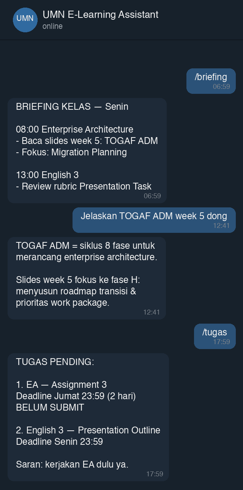

# 🎓 UMN E-Learning Assistant

Bot Telegram yang menyambung langsung ke E-Learning UMN. Tarik materi kuliah, kirim ringkasan pagi sebelum kelas, ingatkan deadline, dan bisa menulis draf tugas berformat dokumen resmi.



<div align="center">
  
</div>

<p align="center"><sub>Versi interaktif (klik node untuk lihat file sumbernya):
<a href="docs/architecture.html">docs/architecture.html</a></sub></p>

---

## Yang membuatnya beda dari chatbot RAG biasa

**Tahu minggu ke berapa.** Briefing pagi membaca `SEMESTER_START_DATE` dan `SEMESTER_BREAKS` dari `.env`, lalu mencocokkannya dengan roadmap mingguan di file RPKPS. Yang dikirim bukan "materi hari ini" generik, tapi topik minggu berjalan. Kalau modul minggu itu belum ada di E-Learning, bot bilang terus terang, bukan mengarang.

**Nulis dokumen, bukan cuma ngasih jawaban.** `/kerjakan` menarik deskripsi dan lampiran soal dari e-learning, membaca materi kuliah yang relevan, lalu menulis `.docx` dengan format resmi UMN: A4, margin 4-4-3-3, Times New Roman 12pt spasi 1.5, cover lengkap, dan blok kode Consolas.

**Paham konteks percakapan.** Bot ingat 14 pesan terakhir per chat, jadi "lanjut yang minggu 3 dong" atau "soal yang tadi salah" tetap nyambung tanpa kamu mengulang semuanya.

**Paham status tugas, bukan cuma judulnya.** Data diambil dari Timeline API Moodle, lalu dicek ulang ke halaman tugas karena Timeline tidak membawa status submit. Tugas yang sudah kamu kumpulkan tidak muncul lagi sebagai pending.

---

## Fitur

| | |
|---|---|
| **Auto-sync** | Tarik materi, slide, dan lampiran dari E-Learning, termasuk Google Docs, SharePoint, dan OneDrive yang biasanya gagal di-scrape. |
| **Morning briefing** | 07:00 WIB. Ringkasan materi per mata kuliah hari itu, plus checklist persiapan. |
| **Deadline reminder** | 18:00 WIB. Daftar tugas pending lengkap dengan sisa waktu. |
| **`/kerjakan`** | AI menulis draf tugas `.docx` dari soal + materi. Maks 2 per hari via cron, 3 via perintah manual. |
| **`/kumpul`** | Submit hasil ke Moodle lewat draft repository Moodle, bukan upload manual. |
| **AI tutor** | Chat bebas. Menjawab dari materi yang sudah di-cache, bukan dari ingatan model. |
| **Multi-provider** | Gemini (default, 3.8-flash) atau OpenRouter. Ganti dari chat dengan `/model`. |

### Perintah Telegram

| Perintah | Fungsi |
|---|---|
| `/briefing` | Briefing kelas hari ini, on-demand |
| `/tugas` | Daftar tugas pending + sisa deadline |
| `/kerjakan [nomor\|semua]` | AI kerjakan tugas, kirim `.docx` |
| `/kumpul [nomor]` | Submit hasil ke Moodle |
| `/sync` | Tarik materi & tugas terbaru |
| `/courses` | Daftar mata kuliah terdeteksi |
| `/model [provider] [model]` | Lihat atau ganti LLM aktif |
| `/clear` | Hapus riwayat percakapan |
| `/id` | Chat ID kamu (untuk isi `.env`) |

Semua perintah hanya menerima pesan dari `TELEGRAM_CHAT_ID` kamu. Guard-nya di satu titik registrasi handler, jadi tidak ada perintah yang bisa dipakai orang lain.

---

## Setup

Butuh Python 3.10+, akun SSO UMN, API key Gemini (gratis), dan bot Telegram.

```bash
git clone https://github.com/KennyUMN/umn-elearning-assistant.git
cd umn-elearning-assistant
python3 -m venv venv
source venv/bin/activate
pip install -r requirements.txt
cp .env.example .env
```

Isi `.env`:

| Variabel | Isi | Cara dapat |
|---|---|---|
| `UMN_USERNAME` | NIM / username SSO UMN | - |
| `UMN_PASSWORD` | Password SSO UMN | - |
| `GEMINI_API_KEY` | API key Gemini | Gratis di [Google AI Studio](https://aistudio.google.com/) |
| `TELEGRAM_BOT_TOKEN` | Token bot | [@BotFather](https://t.me/BotFather), lalu `/newbot` |
| `TELEGRAM_CHAT_ID` | Chat ID kamu | Kirim pesan ke bot, lalu `/id` |
| `SEMESTER_START_DATE` | `YYYY-MM-DD` hari kuliah pertama | Kalender akademik UMN |

Daftar lengkap ada di [`.env.example`](.env.example). `SEMESTER_BREAKS` diisi kalau ada libur di tengah semester, supaya nomor minggu tetap sinkron setelah UTS.

<details>
<summary><b>🔀 Ganti model LLM</b></summary>

Default-nya Gemini 3.8 Flash. Dari Telegram, tanpa restart:

```
/model                          # lihat provider & model aktif
/model openrouter               # pindah ke OpenRouter
/model openrouter <model_id>    # model OpenRouter lain
/model gemini                   # balik ke Gemini
```

Pilihan ini tersimpan di `data/metadata/llm_state.json` dan bertahan meski service restart. Daftar model OpenRouter yang ada sudah diverifikasi 2026-09-30; slug gratis rot cepat, jadi jalankan `python scripts/check_models.py` kalau dapat error model not found.

</details>

### Jadwal kuliah

Buka `data/metadata/class_schedule.json` dan isi hari/jam/ruang sesuai jadwal kamu. Kode matkul dipakai untuk mencocokkan dengan materi di e-learning.

```bash
python scripts/sync_schedule.py          # deteksi matkul + audit silang dengan jadwal
python scripts/sync_schedule.py --sync   # plus unduh dan ekstrak materinya
```

Daftar mata kuliah selalu terdeteksi otomatis dari e-learning. Yang perlu diisi manual hanya hari/jam/ruang, karena Moodle tidak menyediakan info itu.

### Jalankan

```bash
python sync.py    # tes sinkronisasi dulu
python main.py    # bot + cron scheduler
```

<details>
<summary><b>🐳 Alternatif Docker</b></summary>

```bash
cp .env.example .env   # isi dulu
docker compose up -d
```
</details>

<details>
<summary><b>🤖 Malas setup manual? Pakai AI agent</b></summary>

Copy-paste prompt ini ke agent coding-mu:

```text
Bantu aku deploy project di https://github.com/KennyUMN/umn-elearning-assistant.git
(bot Telegram + RAG untuk e-learning kampusku).

Caraku:
1. Clone repo, baca README.md dan .env.example untuk paham konfigurasinya.
2. Setup Python virtual environment + install dependencies.
3. Tanyakan kepadaku nilai-nilai .env satu per satu dengan penjelasan singkat
   cara mendapatkannya (UMN_USERNAME, UMN_PASSWORD, GEMINI_API_KEY,
   TELEGRAM_BOT_TOKEN, TELEGRAM_CHAT_ID, SEMESTER_START_DATE)
   - jangan minta semua sekaligus.
4. Tulis file .env dari jawabanku.
5. Bantu aku mengisi data/metadata/class_schedule.json sesuai jadwal kuliahku.
6. Jalankan python sync.py; kalau error, diagnosa dan perbaiki sampai sukses.
7. Jalankan python main.py dan pastikan bot merespons /courses di Telegram.

Jelaskan setiap langkah dalam bahasa sederhana.
```
</details>

---

## Cara kerjanya

```
Mahasiswa --chat--> Telegram Bot --> AI Service --> Gemini / OpenRouter
                         |                  ^
                         |             RAG context
                         v                  |
                    Moodle Client      Extracted Text
                         |                  ^
                         v                  |
               Document Parser --> Materials Cache
                         ^                  |
                         +------- E-Learning UMN

Cron Scheduler --> sync harian, briefing 07:00, reminder 18:00, auto-worker 19:00
```

Semua materi dan teks hasil ekstraksi ada di `data/`, yang di-gitignore. Tidak ada database dan tidak ada migrations. Kalau hilang, jalankan `/sync` lagi.

---

## Batasan yang perlu kamu tahu

**Hasil `/kerjakan` itu draf, wajib dibaca dulu.** AI bisa salah paham soal, dan yang dinilai dosen pada akhirnya adalah kamu. Prompt-nya sudah didesain supaya model menulis jujur: kalau angka tidak ada di materi, dia wajib bilang tidak ada, bukan mengarang. Tapi itu tetap bukan jaminan.

**Materi ajar bisa berubah, bot tidak.** Kalau dosen upload modul baru, jalankan `/sync`. Briefing membaca cache lokal, bukan scraping real-time.

**Scraping bisa patah.** E-Learning UMN adalah Moodle, dan Moodle kadang mengubah tampilan. Kalau `/sync` tiba-tiba mengembalikan 0 mata kuliah, cek manual di browser. `moodle_client.py` sudah gagal-fast sejak commit `22e42ab`: ia tidak diam-diam lanjut dengan data kosong.

**Cuma jalan di satu orang.** Guard `owner_only` itu disengaja. Kalau mau dipakai multi-user, perlu tabel role yang belum ada.

**Dokumen dikirim untuk direview, bukan otomatis dikumpulkan.** `/kumpul` ada, tapi pemicunya di tangan kamu, bukan di cron.

---

## Struktur

```
umn-elearning-assistant/
├── data/
│   ├── materials/          # file asli dari e-learning
│   ├── extracted_text/     # teks hasil ekstraksi, ini yang dibaca RAG
│   ├── assignment_attachments/
│   ├── assignments_output/ # hasil /kerjakan
│   └── metadata/           # courses, assignments, jadwal, state
├── src/
│   ├── moodle_client.py     # login, scrape, submit
│   ├── document_parser.py   # PDF/PPTX/DOCX ke teks
│   ├── ai_service.py        # RAG, prompt, dispatch LLM
│   ├── telegram_bot.py      # handler + guard
│   ├── scheduler.py         # cron
│   ├── assignment_worker.py # pipeline /kerjakan
│   ├── academic_styler.py   # format dokumen UMN
│   ├── anti_slop.py         # filter pola tulis ala AI
│   ├── conversation_manager.py
│   └── config.py
├── scripts/
│   ├── sync_schedule.py
│   ├── qa_audit.py          # 88 test
│   └── check_models.py      # cek model LLM masih hidup
├── docs/architecture.html   # diagram interaktif
├── main.py
└── sync.py
```

---

## Pengembangan

```bash
python scripts/qa_audit.py      # 88 test, jalan di CI tiap push
python scripts/check_models.py  # pastikan nama model LLM tidak basi
```

`check_models.py` itu penting. Nama model AI berubah cepat: Gemini 2.5 sudah dihapus Google, dan slug gratis OpenRouter rot tiap minggu. Tanpa cek berkala, daftar hardcode di `ai_service.py` akan diam-diam membuang request gagal setiap kali generate.

## Lisensi

MIT. Pakai buat sendiri, ganti, atau deploy ulang sesuka kamu.
